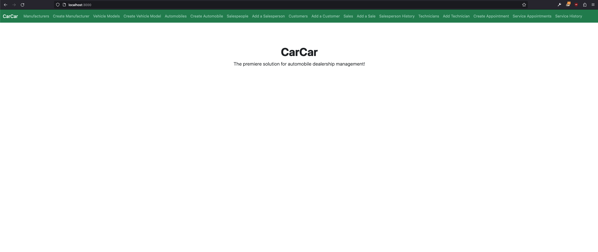
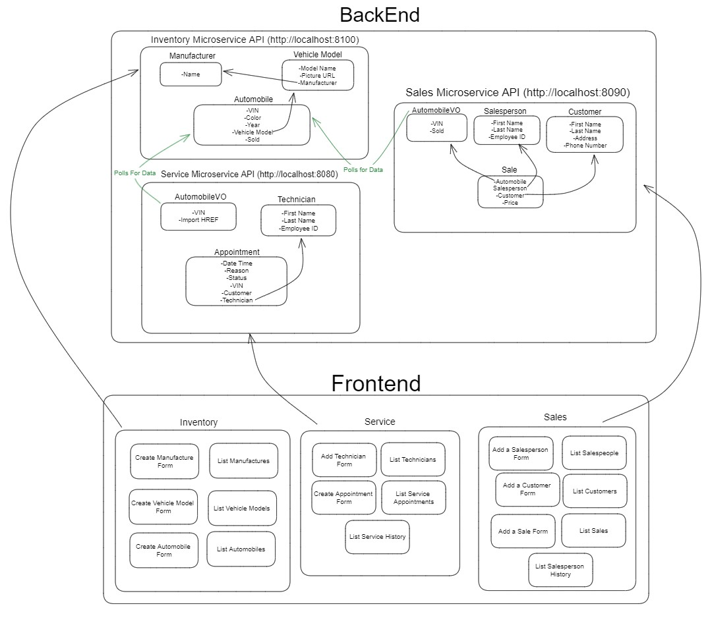

# CarCar

### **Team**:

* Miguel Robles - Service microservice
* Joseph Ferraro - Sales microservice


### **How to Run this Project**

1. Download and install **Docker Desktop** [here](https://www.docker.com/products/docker-desktop/)
2. Open Terminal and choose the directory you will be working on by running this command:
	> `cd directory_name` <br><small>(change "directory_name" to your respective directory)</small>
3. Fork and Clone Project-Beta from Git
	> `git clone paste_copied_HTTPS_URL_here`
4. Change your working directory to the directory you just cloned
	> `cd car-car`
5. Create the volume in Docker
	> `docker volume create beta-data`
6. Build the images on Docker
	> `docker-compose build`
7. Run the container from the images you just created
	> `docker-compose up` <br><small>(at this point you should see all 7 container running on Docker Desktop)</small>
8. Open a browser of choice.  Google Chrome is *recommended*.
9. Head over to http://localhost:3000/ in your browser to start browsing through the website!
	- This URL will take you to the homepage of our project, CarCar!
		<details>
		<summary>This is what you should see</summary>

		
		</details>


## **Design**

An applicaton designed to help car dealerships keep track of their available invintory, sales, and services.


___


# **Inventory microservice**

There are 3 models in this microservice:
- `Manufacturer`
- `VehicleModel`
- `Automobile`

This microservice has data within the Automobile model that gets polled from the Service and Sales microservices for use

### Manufacturer model:
- The **Manufacturer** model contains a neame field.

### Vehicle model:
- The **Vehicle** model contains a many to one relationship with the **Manufacturer** model.  It also contains  picture_url and name fields

### Automobile:
- The **Automobile** model contains a many to one relationship with the **Vehicle** model.  It also contains color, year, vin, and sold fields.

## **Manufacturers APIs**

|Action                        |Method|URL                                         |
|------------------------------|------|--------------------------------------------|
|List manufacturers            |GET   |http://localhost:8100/api/manufacturers/    |
|Create a manufacturer         |POST  |http://localhost:8100/api/manufacturers/    |
|Get a specific manufacturer   |GET   |http://localhost:8100/api/manufacturers/:id/|
|Update a specific manufacturer|PUT   |http://localhost:8100/api/manufacturers/:id/|
|Delete a specific manufacturer|DELETE|http://localhost:8100/api/manufacturers/:id/|

### *Create a Manufacturer*

- Method: 'POST'
- URL: 'http://localhost:8100/api/manufacturers/'

+ <details>
	<summary>
	Creating a manufacturer requires only the manufacturer's name.
	</summary>

	**JSON body:**
	```json
	{
	"name": "Chrysler"
	}
	```

	**Response**:
	```json
	{
	"href": "/api/manufacturers/1/",
	"id": 1,
	"name": "Chrysler"
	}
	```
</details>

### *List Manufacturers*

- Method: 'GET'
- URL: 'http://localhost:8100/api/manufacturers/'

+ <details>
	<summary>
	The list of manufacturers is a dictionary with the key "manufacturers" set to a list of manufacturers.
	</summary>

	**Response**:
	```json
	{
	"manufacturers": [
		{
		"href": "/api/manufacturers/1/",
		"id": 1,
		"name": "Daimler-Chrysler"
		}
	]
	}
	```
</details>

### *Edit Manufacturer*

- Method: 'PUT'
- URL: 'http://localhost:8100/api/manufacturers/:id'

+ <details>
	<summary>
		Updating a manufacturer requires only the manufacturer's name.
	</summary>

	**JSON body:**
	```json
	{
	"name": "Chrysler"
	}
	```

	**Response**:
	```json
	{
	"manufacturers": [
		{
		"href": "/api/manufacturers/1/",
		"id": 1,
		"name": "Daimler-Chrysler"
		}
	]
	}
	```
</details>

### *Delete Manufacturer*

- Method: 'DELETE'
- URL: 'http://localhost:8100/api/manufacturers/:id'

+ <details>
	<summary>Deleting a manufacturer.</summary>

	**Response**:
	```json
	{
		"id": null,
		"name": "Chryslr"
	}
	```
</details>

## **Vehicle Model APIs**

|Action                         |Method|URL                                  |
|-------------------------------|------|-------------------------------------|
|List vehicle models            |GET   |http://localhost:8100/api/models/    |
|Create a vehicle model         |POST  |http://localhost:8100/api/models/    |
|Get a specific vehicle model   |GET   |http://localhost:8100/api/models/:id/|
|Update a specific vehicle model|PUT   |http://localhost:8100/api/models/:id/|
|Delete a specific vehicle model|DELETE|http://localhost:8100/api/models/:id/|

### *Create a Vehicle Model*

- Method: 'POST'
- URL: 'http://localhost:8100/api/models/'

+ <details>
	<summary>
		Creating a vehicle model requires the model name, a URL of an image, and the id of the manufacturer.
	</summary>

	**JSON body:**
	```json
	{
	"name": "Sebring",
	"picture_url": "https://upload.wikimedia.org/wikipedia/commons/thumb/7/71/Chrysler_Sebring_front_20090302.jpg/320px-Chrysler_Sebring_front_20090302.jpg",
	"manufacturer_id": 1
	}
	```

	**Response**:
	```json
	{
	"name": "Sebring",
	"picture_url": "https://upload.wikimedia.org/wikipedia/commons/thumb/7/71/Chrysler_Sebring_front_20090302.jpg/320px-Chrysler_Sebring_front_20090302.jpg"
	}
	```
</details>

### *Update a Vehicle Model*

- Method: 'PUT'
- URL: 'http://localhost:8100/api/models/:id/'

+ <details>
	<summary>
		Updating a vehicle model can take the name and/or the picture URL. It is not possible to update a vehicle model's manufacturer.
	</summary>

	**JSON body:**
	```json
	{
	"name": "Sebring",
	"picture_url": "https://upload.wikimedia.org/wikipedia/commons/thumb/7/71/Chrysler_Sebring_front_20090302.jpg/320px-Chrysler_Sebring_front_20090302.jpg"
	}
	```
</details>

### *Get a specific Vehicle Model*

- Method: 'GET'
- URL: 'http://localhost:8100/api/models/:id/'

+ <details>
	<summary>
	Getting the detail of a vehicle model.
	</summary>

	**JSON body:**
	```json
	{
	"href": "/api/models/1/",
	"id": 1,
	"name": "Sebring",
	"picture_url": "https://upload.wikimedia.org/wikipedia/commons/thumb/7/71/Chrysler_Sebring_front_20090302.jpg/320px-Chrysler_Sebring_front_20090302.jpg",
	"manufacturer": {
		"href": "/api/manufacturers/1/",
		"id": 1,
		"name": "Daimler-Chrysler"
	}
	}
	```
</details>

### *List Vehicle Models*

- Method: 'GET'
- URL: 'http://localhost:8100/api/models/'

+ <details>
	<summary>
		Getting a list of vehicle models returns a list of the detail information with the key "models".
	</summary>

	**JSON body:**
	```json
	{
	"models": [
		{
		"href": "/api/models/1/",
		"id": 1,
		"name": "Sebring",
		"picture_url": "https://upload.wikimedia.org/wikipedia/commons/thumb/7/71/Chrysler_Sebring_front_20090302.jpg/320px-Chrysler_Sebring_front_20090302.jpg",
		"manufacturer": {
			"href": "/api/manufacturers/1/",
			"id": 1,
			"name": "Daimler-Chrysler"
		}
		}
	]
	}
	```
</details>

### *Delete a Vehicle Model*

- Method: 'DELETE'
- URL: 'http://localhost:8100/api/models/:id/'

+ <details>
	<summary>Delete a specific vehicle model</summary>

	**RESPONSE:**
	```json
	{
		"id": null,
		"name": "Sebring",
		"picture_url": "https://upload.wikimedia.org/wikipedia/commons/thumb/7/71/Chrysler_Sebring_front_20090302.jpg/320px-Chrysler_Sebring_front_20090302.jpg",
		"manufacturer": {
			"href": "/api/manufacturers/5/",
			"id": 5,
			"name": "Chryslr"
		}
	}
	```
</details>

## **Automobiles APIs**

|Action                      |Method|URL                                        |
|----------------------------|------|-------------------------------------------|
|List automobiles            |GET   |http://localhost:8100/api/automobiles/     |
|Create an automobile        |POST  |http://localhost:8100/api/automobiles/     |
|Get a specific automobile   |GET   |http://localhost:8100/api/automobiles/:vin/|
|Update a specific automobile|PUT   |http://localhost:8100/api/automobiles/:vin/|
|Delete a specific automobile|DELETE|http://localhost:8100/api/automobiles/:vin/|

### *Create an Automobile*

- Method: 'POST'
- URL: 'http://localhost:8100/api/automobiles/'

+ <details>
	<summary>
		You can create an automobile with its color, year, VIN, and the id of the vehicle model.
	</summary>

	**JSON body:**
	```json
	{
	"color": "black",
	"year": 2020,
	"vin": "1C3CDZAG2DN659910",
	"model_id": 1
	}
	```

	**Response**:
	```json
	{
		"href": "/api/automobiles/1C3CDZAG2DN659910/",
		"id": 5,
		"color": "black",
		"year": 2020,
		"vin": "1C3CDZAG2DN659910",
		"model": {
			"href": "/api/models/1/",
			"id": 1,
			"name": "Mustang",
			"picture_url": "https://images.pexels.com/photos/544542/pexels-photo-544542.jpeg?auto=compress&cs=tinysrgb&w=1260&h=750&dpr=2",
			"manufacturer": {
				"href": "/api/manufacturers/1/",
				"id": 1,
				"name": "Ford"
			}
		},
		"sold": false
	}
	```
</details>

### *Get a specific Automobile*

- Method: 'GET'
- URL: 'http://localhost:8100/api/automobiles/:vin/'

+ <details>
	<summary>
		Get the details for the car with a specfic VIN number.
	</summary>

	**Response**:
	```json
	{
	"href": "/api/automobiles/1C3CC5FB2AN120174/",
	"id": 1,
	"color": "yellow",
	"year": 2013,
	"vin": "1C3CC5FB2AN120174",
	"model": {
		"href": "/api/models/1/",
		"id": 1,
		"name": "Sebring",
		"picture_url": "https://upload.wikimedia.org/wikipedia/commons/thumb/7/71/Chrysler_Sebring_front_20090302.jpg/320px-Chrysler_Sebring_front_20090302.jpg",
		"manufacturer": {
		"href": "/api/manufacturers/1/",
		"id": 1,
		"name": "Daimler-Chrysler"
		}
	},
	"sold": false
	}
	```
</details>

### *Update a specific Automobile*

- Method: 'PUT'
- URL: 'http://localhost:8100/api/automobiles/:vin/'

+ <details>
	<summary>You can update the color, year, and sold status of an automobile.</summary>

	**JSON body:**
	```json
	{
	"color": "red",
	"year": 2012,
	"sold": true
	}
	```
</details>

### *List Automobiles*

- Method: 'GET'
- URL: 'http://localhost:8100/api/automobiles/'

+ <details>
	<summary>
	Getting a list of automobiles returns a dictionary with the key "autos" set to a list of automobile information.</summary>

	**Response**:
	```json
	{
	"autos": [
		{
		"href": "/api/automobiles/1C3CC5FB2AN120174/",
		"id": 1,
		"color": "yellow",
		"year": 2013,
		"vin": "1C3CC5FB2AN120174",
		"model": {
			"href": "/api/models/1/",
			"id": 1,
			"name": "Sebring",
			"picture_url": "https://upload.wikimedia.org/wikipedia/commons/thumb/7/71/Chrysler_Sebring_front_20090302.jpg/320px-Chrysler_Sebring_front_20090302.jpg",
			"manufacturer": {
			"href": "/api/manufacturers/1/",
			"id": 1,
			"name": "Daimler-Chrysler"
			}
		},
		"sold": false
		}
	]
	}
	```
</details>

### *Delete a specific Automobile*

- Method: 'DELETE'
- URL: 'http://localhost:8100/api/automobiles/:vin/'

+ <details>
	<summary>Delete a specific Automobile</summary>

	**Response**:
	```json
	{
		"href": "/api/automobiles/3VWLL7AJ7EM433787/",
		"id": null,
		"color": "red",
		"year": 2012,
		"vin": "3VWLL7AJ7EM433787",
		"model": {
			"href": "/api/models/2/",
			"id": 2,
			"name": "Sebring",
			"picture_url": "https://upload.wikimedia.org/wikipedia/commons/thumb/7/71/Chrysler_Sebring_front_20090302.jpg/320px-Chrysler_Sebring_front_20090302.jpg",
			"manufacturer": {
				"href": "/api/manufacturers/5/",
				"id": 5,
				"name": "Chryslr"
			}
		},
		"sold": false
	}
	```

	**JSON body:**
	```json
	{
		"color": "red",
	"year": 2012,
	"sold": true
	}
	```
</details>

___
# **Service microservice**

There are 3 models in this microservice:
- Technician
- AutomobileVO
- Appointment

### AutomobileVO model
This model polls data from the Inventory microservice's Automobile model, specifically the VIN field.
We need their VIN data to compare to this microservice's VIN data when an appointment is created to determine whether or not the customer is granted VIP status.

We poll data from the *Automobile* model within the **Inventory microservice** to use in our *AutomobileVO* model in this microservice.

### Technician model
This model stores data on the technicians. The API endpoints here are to view the list of technicians and the form to create a new technician and add it to the list.

### Appointment model
This model stores data on Service Appointments. The API endpoints here are to view the list of Service appointments and a form to create a new Service appointment.
One thing to note on this list is that if the VIN of a vehicle matches the VIN from a car that was in the Inventory microservice, that customer is granted "VIP" status because that means the vehicle was purchased from their dealership.

## *Service APIs*

|Action                            |Method|URL                                              |
|----------------------------------|------|-------------------------------------------------|
|List technicians                  |GET   |http://localhost:8080/api/technicians/           |
|Create a technician               |POST  |http://localhost:8080/api/technicians/           |
|Delete a specific technician      |DELETE|http://localhost:8080/api/technicians/:id        |
|List appointments                 |GET   |http://localhost:8080/api/appointments/          |
|Create an appointment             |POST  |http://localhost:8080/api/appointments/          |
|Delete an appointment             |DELETE|http://localhost:8080/api/appointments/:id       |
|Set appointment status to canceled|PUT   |http://localhost:8080/api/appointments/:id/cancel|
|Set appointment status to finished|PUT   |http://localhost:8080/api/appointments/:id/finish|

### *List Technicians*
- Method: 'GET'
- URL: 'http://localhost:8080/api/technicians/'

+ <details>
	<summary>Lists the technicians</summary>

	**Response**:
	```json
	[
		{
			"first_name": "Miguel",
			"last_name": "Robles",
			"employee_id": "mrobles",
			"id": 1
		}
	]
	```
</details>

### *Create Technician*
- Method: 'POST'
- URL: 'http://localhost:8080/api/technicians/create/'

+ <details>
	<summary>Creates a technician</summary>

	**JSON body:**
	```json
	{
		"first_name": "John",
		"last_name": "Doe",
		"employee_id": "jdoe"
	}
	```

	**Response**:
	```json
	[
	{
		"first_name": "John",
		"last_name": "Doe",
		"employee_id": "jdoe",
		"id": 2
	},
	]
	```
</details>

### *List Appointments*
- Method: 'GET'
- URL: 'http://localhost:8080/api/appointments/'

+ <details>
	<summary>Lists the appointments</summary>

	**Response**:
	```json
	{
		"appointments": [
			{
				"id": 4,
				"vin": "1G8ZH52881Z281312",
				"customer": "Mike Hawk",
				"date_time": "2023-04-27T06:00:00+00:00",
				"reason": "Low on Blinker Fluid",
				"technician": {
					"first_name": "Juan",
					"last_name": "Robles",
					"employee_id": "jrobles",
					"id": 2
				},
				"status": "Created"
			}
		]
	}
	```
</details>

### *Create Appointment*
- Method: 'POST'
- URL: 'http://localhost:8080/api/appointments/create/'

+ <details>
	<summary>Creates an appointment</summary>

	**JSON body:**
	```json
	{
	"vin": "5NPEU46F26H025085",
	"customer": "Marvin Oldboy",
	"date_time": "2023-05-01T14:30:00",
	"reason": "Tire Change",
	"technician": 1
	}
	```

	**Response**:
	```json
	{
		"id": 5,
		"vin": "5NPEU46F26H025085",
		"customer": "Marvin Oldboy",
		"date_time": "2023-05-01T14:30:00",
		"reason": "Tire Change",
		"technician": {
			"first_name": "Miguel",
			"last_name": "Robles",
			"employee_id": "mrobles",
			"id": 1
		},
		"status": "Created"
	}
	```
</details>

### *Set appointment status to canceled*
- Method: 'PUT'
- URL: 'http://localhost:8080/api/appointments/:id/cancel/'

+ <details>
	<summary>This will set an appointment's status to *Canceled*, therefore removing it from the list of appointments.</summary>

	**JSON body:**
	```json
	{
	"status": "Canceled"
	}
	```

	**Response**:
	```json
	{
		"id": 1,
		"vin": "5NPEU46F26H025085",
		"customer": "Marvin Oldboy",
		"date_time": "2023-05-01T14:30:00+00:00",
		"reason": "Tire Change",
		"technician": {
			"first_name": "John",
			"last_name": "Doe",
			"employee_id": "jdoe",
			"id": 1
		},
		"status": "Canceled"
	}
	```
</details>

### *Set appointment status to finished*
- Method: 'PUT'
- URL: 'http://localhost:8080/api/appointments/:id/finish/'

+ <details>
	<summary>This will set an appointment's status to *Finished*, therefore removing it from the list of appointments.</summary>

	**JSON body:**
	```json
	{
	"status": "Finished"
	}
	```

	**Response**:
	```json
	{
		"id": 1,
		"vin": "5NPEU46F26H025085",
		"customer": "Marvin Oldboy",
		"date_time": "2023-05-01T14:30:00+00:00",
		"reason": "Tire Change",
		"technician": {
			"first_name": "John",
			"last_name": "Doe",
			"employee_id": "jdoe",
			"id": 1
		},
		"status": "Finished"
	}
	```
</details>


### Service History
- Method: 'GET'
- URL: 'http://localhost:8080/api/appointments/all/

+ <details>
	<summary>This API endpoint takes you to the Service History page which lists all of the appointments that are currently active, and those that have been completed via *Finished* or *Canceled*.
	If an appointment is still active in the service appointments list, this page will default the status of that appointment to *Created*.</summary>

	**Response**:
	```json
	{
		"appointments": [
			{
				"id": 1,
				"vin": "5NPEU46F26H025085",
				"customer": "Marvin Oldboy",
				"date_time": "2023-05-01T14:30:00+00:00",
				"reason": "Tire Change",
				"technician": {
					"first_name": "New",
					"last_name": "Doe",
					"employee_id": "jdoe",
					"id": 1
				},
				"status": "Finished"
			},
			{
				"id": 2,
				"vin": "1GNDT13W5R2133070",
				"customer": "Fake Name",
				"date_time": "2023-04-12T14:37:00+00:00",
				"reason": "Oil Change",
				"technician": {
					"first_name": "John",
					"last_name": "Doe",
					"employee_id": "jdoe",
					"id": 1
				},
				"status": "Cancelled"
			}
		]
	}
	```
</details>

___


# Sales microservice

There are 4 models in the sales microservice a **Salesperson** model, a **Cutomer** model, an **AutomobileVO** model, and, the reason the microservice was created, a **Sales** model.  The sales maicroservice polls data from the inventory microservice

### Salesperson model

- The **Salesperson** model contains  a first name, last name and a unique employee ID fields.

### Customer model

- The **Customer** model contains a first name, last name, address and phone number fields.

### AutomobileVO model

- The **AutomobileVO** model contains a vin and sold fields.  It recieves the automobile data from poller.py, pollar.py is polling for data from the Inventory microservice.  The pollar.py file checks if a VIN number that is being polled is already in the **AutomobileVO** model before creating a new **AutomobileVO** object.

### Sale model

- The **Sale** model has a one to one relationship with the **AutomobileVO** model because you can only have one automobile in a sale.  The **Sale** model has a one to many relationship with the  **Salesperson** and **Customer** models because the salesperson and the customer can have many sales.  It also contains a price field.

## Sales API's

|Action                       |Method|URL                                      |
|-----------------------------|------|-----------------------------------------|
|List salespeople             |GET   |http://localhost:8090/api/salespeople/   |
|Create a salesperson         |POST  |http://localhost:8090/api/salespeople/   |
|Delete a specific salespeople|DELETE|http://localhost:8090/api/salespeople/:id|
|List customer                |GET   |http://localhost:8090/api/customers/     |
|Create a customer            |POST  |http://localhost:8090/api/customers/     |
|Delete a specific customer   |DELETE|http://localhost:8090/api/customers/:id  |
|List sales                   |GET   |http://localhost:8090/api/sales/         |
|Create a sale                |POST  |http://localhost:8090/api/sales/         |
|Delete a sale                |DELETE|http://localhost:8090/api/sales/:id      |
|List available cars          |GET   |http://localhost:8090/api/cars/          |
|Update available car         |PUT   |http://localhost:8090/api/cars/:id       |

#### **All list GET requests will be status=400 if there is no OBJECT in the MODEL**

### **List Salespeople:**

- Method: 'GET'
- URL: http://localhost:8090/api/salespeople/

+ <details>
	<summary>A list of salespeople.</summary>

	**RESPONSE**
	```json
	{
		"salespeople": [
			{
				"id": 1,
				"first_name": "John",
				"last_name": "Denver",
				"employee_id": "jdenver"
			},
			{
				"id": 2,
				"first_name": "Bob",
				"last_name": "WeHadaBabyItsABoy",
				"employee_id": "bboy"
			}
		]
	}
	```
</details>

### **Create a Salesperson:**

- Method: 'POST'
- URL: http://localhost:8090/api/salespeople/

+ <details>
	<summary>Create a salesperson.</summary>

	**JSON body**
	```json
	{
			"first_name": "I",
			"last_name": "am",
			"employee_id": "aTest"
	}
	```
	**RESPONSE**
	```json
	{
		"id": 1,
		"first_name": "I",
		"last_name": "am",
		"employee_id": "aTest"
	}
	```
</details>

### **Delete Salesperson:**

- Method: 'DELETE'
- URL: http://localhost:8090/api/salespeople/:id

+ <details>
	<summary>Delete a specific salesperson.</summary>

	**RESPONSE (status=200)**
	```json
	{
		"message": "deleted"
	}
	```
	**RESPONSE (status=400)**
	```json
	{
		"message": "Saleperson Object not present, Unable to delete"
	}
	```
</details>

### **List Customers:**

- Method: 'GET'
- URL: http://localhost:8090/api/customers/

+ <details>
	<summary>A list of customers.</summary>

	**RESPONSE**
	```json
	{
		"customers": [
			{
				"id": 1,
				"first_name": "Dan",
				"last_name": "Man",
				"address": "1234 Fake St",
				"phone_number": "3138675309"
			},
			{
				"id": 2,
				"first_name": "I",
				"last_name": "am    ",
				"address": "a test",
				"phone_number": "1234567890"
			}
		]
	}
	```
</details>

### **Create Customer:**

- Method: 'POST'
- URL: http://localhost:8090/api/customers/

+ <details>
	<summary>Create a customer</summary>

	**JSON body**
	```json
	{
		"first_name": "Bob",
		"last_name": "WeHadABabyItsABoy",
		"address": "1234 Fake St.",
		"phone_number": "9999999979"
	}
	```
	**RESPONSE**
	```json
	{
		"id": 1,
		"first_name": "Bob",
		"last_name": "WeHadABabyItsABoy",
		"address": "1234 Fake St.",
		"phone_number": "9999999979"
	}
	```
</details>

### **Delete Customer:**

- Method: 'DELETE'
- URL: http://localhost:8090/api/customers/:id

+ <details>
	<summary>Delete a specific customer.</summary>

	**RESPONSE (status=200)**
	```json
	{
		"message": "deleted"
	}
	```
	**RESPONSE (status=400)**
	```json
	{
		"message": "Customer Object not present, Unable to delete"
	}
	```
</details>

### **List Sales:**

- Method: 'GET'
- URL: http://localhost:8090/api/sales/

+ <details>
	<summary>A list of sales.</summary>

	**RESPONSE**
	```json
	{
		"sales": [
			{
				"id": 5,
				"automobile": {
					"id": 5,
					"vin": "1LNHM81V87Y600143",
					"sold": true
				},
				"salesperson": {
					"id": 2,
					"first_name": "Dan",
					"last_name": "Bob",
					"employee_id": "dbob"
				},
				"customer": {
					"id": 2,
					"first_name": "Al",
					"last_name": "Capone",
					"address": "Alcatraz",
					"phone_number": "1234567890"
				},
				"price": "1000"
			}
		]
	}
	```
</details>

### **Create Sale:**

- Method: 'POST'
- URL: http://localhost:8090/api/sales/

+ <details>
	<summary>Create a sale.</summary>

	**JSON body**
	```json
	{
		"automobile": "1HGCT2B88DA000025",
		"salesperson": "2",
		"customer": "2",
		"price": 200
	}
	```
	**RESPONSE**
	```json
	{
		"id": 1,
		"automobile": {
			"id": 2,
			"vin": "1HGCT2B88DA000025",
			"sold": false
		},
		"salesperson": {
			"id": 2,
			"first_name": "Dan",
			"last_name": "Bob",
			"employee_id": "Dbab"
		},
		"customer": {
			"id": 2,
			"first_name": "ada",
			"last_name": "earrrrrrrrrrrr",
			"address": "adaf",
			"phone_number": "1234"
		},
		"price": 200
	}
	```
	- **NOTE:** The automobile updating to `sold: true` is handled through the front end using fetch requests.  So when testing in something, in a program like insomnia the `sold` value may be `true` or `false`.
</details>

### **Delete a Sale:**

- Method: 'DELETE'
- URL: http://localhost:8090/api/sales/:id

+ <details>
	<summary>Delete a specific sale.</summary>

	**RESPONSE (status=200)**
	```json
	{
		"message": "deleted"
	}
	```
	**RESPONSE (status=400)**
	```json
	{
		"message": "Sale Object not present, Unable to delete"
	}
	```
</details>

### **List Available Cars:**

- Method: 'GET'
- URL: http://localhost:8090/api/cars/

+ <details>
	<summary>A filtered list of **AutomobileVO** objects by sold: False.</summary>

	**RESPONSE (status=200)**
	```json
	{
		"cars": [
			{
				"id": 2,
				"vin": "1G1ND52JX3M623371",
				"sold": false
			}
		]
	}
	```
	**RESPONSE (status=400)**
	```json
	{
		"message": "No Available Cars Found"
	}
	```
</details>

### **Update Available Car:**

- Method: 'GET'
- URL: http://localhost:8090/api/cars/:id/

+ <details>
	<summary>Updates a specific **AutomobileVO** object to sold: True on sale submission.</summary>

	**JSON body**
	```json
	{
		"sold": true
	}
	```
	**RESPONSE**
	```json
	{
		"id": 2,
		"vin": "1HGCT2B88DA000025",
		"sold": true
	}
	```
</details>
